<picture>
  <source media="(prefers-color-scheme: dark)" srcset="assets/cards/header-dark.svg">
  
</picture>

<!-- live:stats -->

  <picture>
    <source media="(prefers-color-scheme: dark)" srcset="assets/cards/stats-dark.svg">
    
  </picture>

<!-- /live:stats -->

I build software for the way money actually moves in Kenya: SACCOs, chamas and churches, M-Pesa, SMS, and the credit checks that come before a loan. I'm an IT graduate of the **Technical University of Kenya** and work across the whole stack, from database schema and row-level security to the screens people use on a phone. I ship with tests: the Jamii platform I work on runs more than 2,000 of them on every change.

**Next.js · Supabase · Laravel · Kotlin · PostgreSQL · M-Pesa Daraja**

## What I'm working on now

November 2026

- **CRB Lookup at Wakandi.** "Check before you lend" for SACCOs, MFIs and chamas: credit checks inside a loan application, results that expire, a full audit log, and an API that loan products call with keys.
- **M-Pesa top-ups for Jamii Connect.** STK Push per bundle, confirming the number before the prompt, and recovering payments whose callback never arrived.
- **Support chatbot and knowledge base.** A Brevo chat that onboards new customers, answering from a knowledge base written against the live app.
- **SOKA, Sprint 1.** A league app for EA SPORTS FC friends: fair fixtures, results both players confirm, and live tables.

## Featured work

### At Wakandi Kenya, on the Jamii platform

  <picture>
    <source media="(prefers-color-scheme: dark)" srcset="assets/cards/wakandi-crb-dark.svg">
    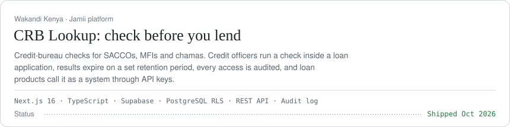
  </picture>

  <picture>
    <source media="(prefers-color-scheme: dark)" srcset="assets/cards/wakandi-payments-dark.svg">
    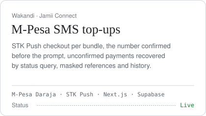
  </picture>
  <picture>
    <source media="(prefers-color-scheme: dark)" srcset="assets/cards/wakandi-chatbot-dark.svg">
    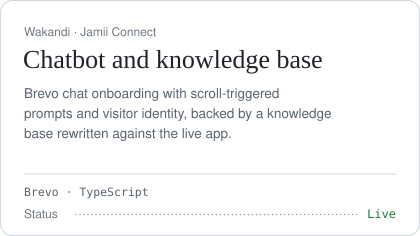
  </picture>

### Personal and client projects

  <a href="https://github.com/MWANZIAMUTINDA/soka-web"><picture>
    <source media="(prefers-color-scheme: dark)" srcset="assets/cards/soka-dark.svg">
    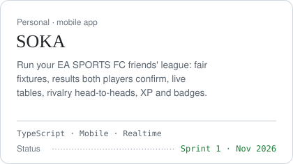
  </picture></a>
  <picture>
    <source media="(prefers-color-scheme: dark)" srcset="assets/cards/mandai-dark.svg">
    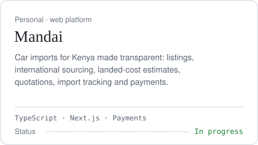
  </picture>

  <picture>
    <source media="(prefers-color-scheme: dark)" srcset="assets/cards/beijing-fc-dark.svg">
    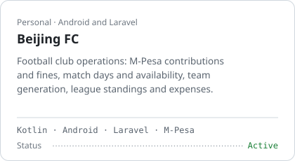
  </picture>
  <picture>
    <source media="(prefers-color-scheme: dark)" srcset="assets/cards/fundi-dark.svg">
    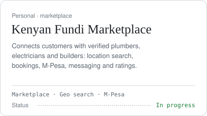
  </picture>

  <a href="https://github.com/MWANZIAMUTINDA/kyeteni-payment"><picture>
    <source media="(prefers-color-scheme: dark)" srcset="assets/cards/kyeteni-dark.svg">
    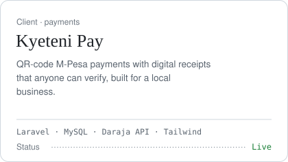
  </picture></a>
  <a href="https://github.com/MWANZIAMUTINDA/SACCO-Health-Check-Automated-Financial-Diagnostic"><picture>
    <source media="(prefers-color-scheme: dark)" srcset="assets/cards/sacco-health-dark.svg">
    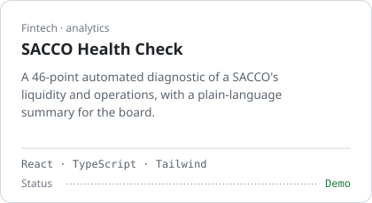
  </picture></a>

  <a href="https://github.com/MWANZIAMUTINDA/nairobi_garbage_detection_system"><picture>
    <source media="(prefers-color-scheme: dark)" srcset="assets/cards/garbage-dark.svg">
    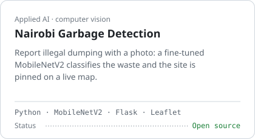
  </picture></a>
  <a href="https://github.com/MWANZIAMUTINDA/MUTHURWA_MARKET_SMART_STALL_BOOKING-SYSTEM"><picture>
    <source media="(prefers-color-scheme: dark)" srcset="assets/cards/muthurwa-dark.svg">
    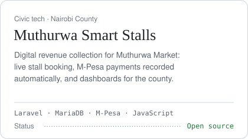
  </picture></a>

## My year in numbers

Most of my work is in private company repos, so these cards count private contributions too. They refresh every night.

<!-- live:year -->

  <picture>
    <source media="(prefers-color-scheme: dark)" srcset="assets/cards/skyline-dark.svg">
    
  </picture>

  <picture>
    <source media="(prefers-color-scheme: dark)" srcset="assets/cards/lines-dark.svg">
    
  </picture>
  <picture>
    <source media="(prefers-color-scheme: dark)" srcset="assets/cards/achievements-dark.svg">
    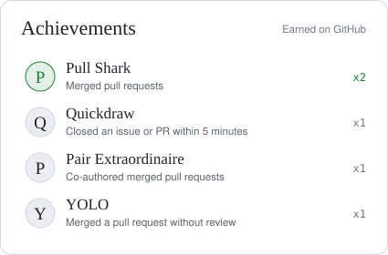
  </picture>

  <picture>
    <source media="(prefers-color-scheme: dark)" srcset="assets/cards/languages-dark.svg">
    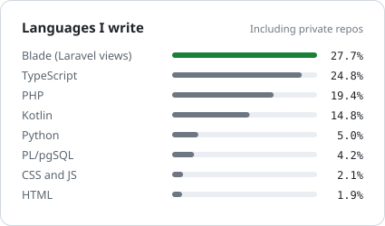
  </picture>
  <picture>
    <source media="(prefers-color-scheme: dark)" srcset="assets/cards/weekdays-dark.svg">
    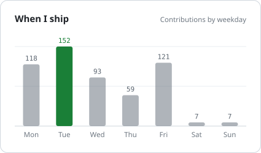
  </picture>

<!-- /live:year -->

Where my Jamii commits went from September to October 2026: CRB Lookup 19, M-Pesa payments 13, chatbot and knowledge base 11, onboarding and referrals 5.

<b>2026, month by month</b>

| 2026 | What happened |
| --- | --- |
| March | Smart stall booking, first version |
| June | Muthurwa Market smart stalls, Skill Connect |
| July | Football ball tracking with computer vision |
| August | Joined Wakandi Kenya; Kyeteni Pay with QR M-Pesa receipts |
| September | SACCO Health Check, Nairobi garbage detection, Jamii M-Pesa top-ups and chatbot |
| October | CRB Lookup shipped, Beijing FC Android app, Mandai, SOKA planned |
| November | SOKA Sprint 1 |

<b>Tech stack</b>

| Area | Tools |
| --- | --- |
| Frontend | TypeScript, JavaScript, React, Next.js, Tailwind CSS |
| Backend | Node.js, PHP and Laravel, Python and Flask |
| Mobile, data and AI | Kotlin and Android, PostgreSQL, Supabase, MySQL, OpenCV |
| Payments and messaging | M-Pesa Daraja, Brevo, SMS |
| Delivery | Docker, Coolify, Vercel, Git and GitHub, Linux |
| Working with | Figma, VS Code, Claude Code |

<b>How I work</b>

| Step | What it means |
| --- | --- |
| **Understand** | Learn the domain first: how a SACCO lends, how a church collects giving, how a chama tracks contributions. |
| **Read before writing** | Check the existing code, data and patterns before adding anything new. |
| **Small, tested steps** | Small pull requests, each one with tests, and row-level security checked in the database itself. |
| **Ship and watch** | Deploy with Docker and Coolify, then check it works for real users. |

## Beyond code

- **Football.** I play, follow the tactics, and build tools for my club.
- **Streetwear and sneakers.** Jordans and caps.
- **Anime and manga.** My favourite character is Mikasa from *Attack on Titan*.
- **Learning.** Distributed systems and AI agents.

 

## Work with me

<a href="mailto:smutinda301@gmail.com"><picture>
  <source media="(prefers-color-scheme: dark)" srcset="assets/cards/contact-dark.svg">
  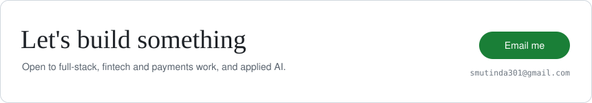
</picture></a>

Email [smutinda301@gmail.com](mailto:smutinda301@gmail.com), or message me here on GitHub.
